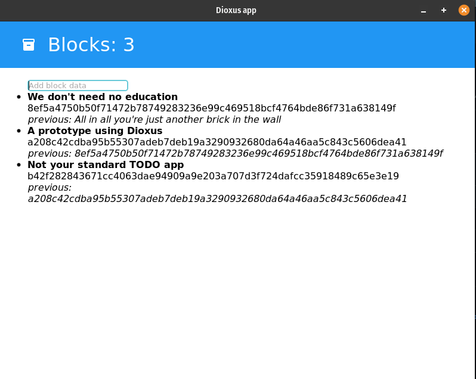

# rust-dioxus-block-chain

An exploratory look at Rust web UI library Dioxus - [see video here](https://www.youtube.com/watch?v=KmqExCoR69g)

## Description

I built a visual blockchain prototype built in Rust and Dioxus.

## Version

See [Cargo.toml](Cargo.toml) version

## Platforms / Technologies

- [Rust](https://www.rust-lang.org/en-US/)
- [Cargo](https://doc.rust-lang.org/cargo/)
- [Dioxus](https://dioxuslabs.com/)

## Run

>      $ cargo run
